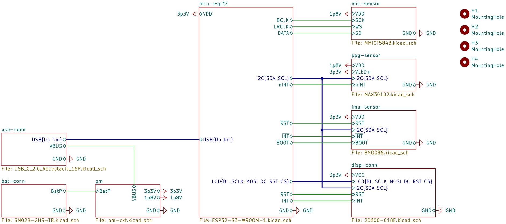
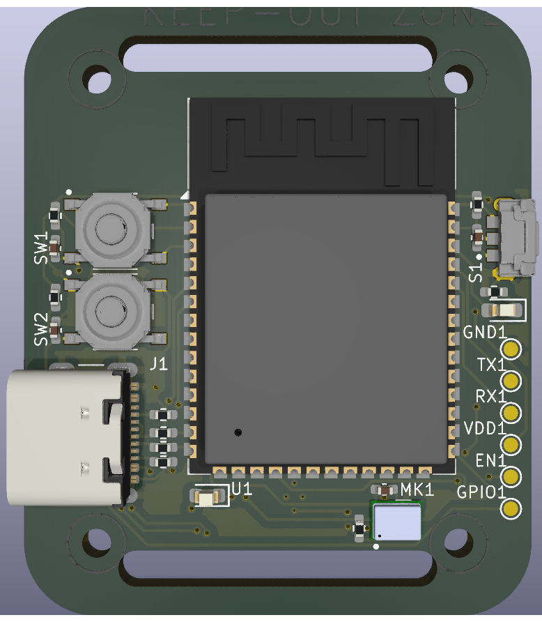
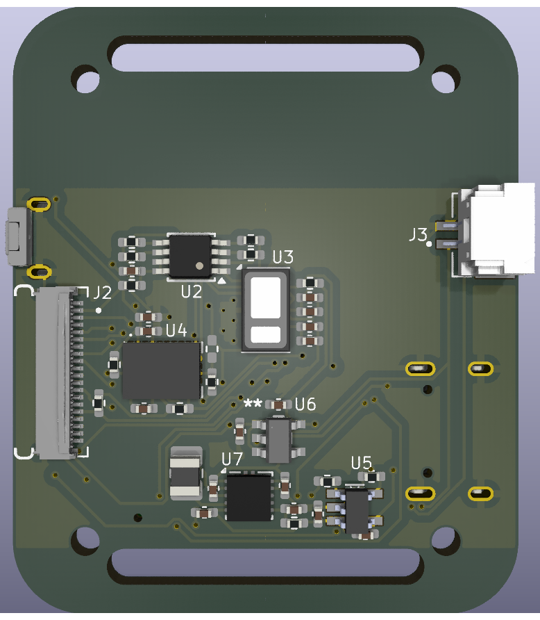
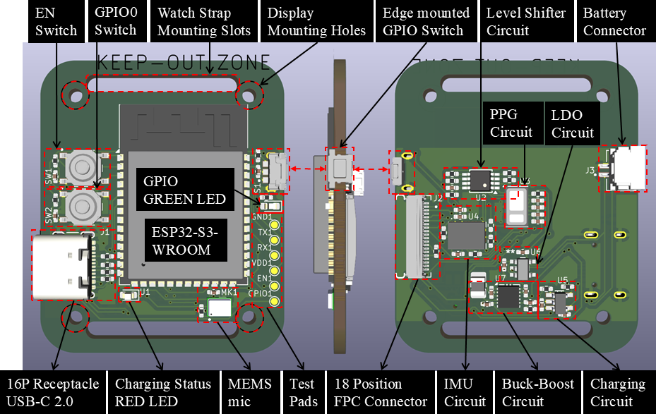
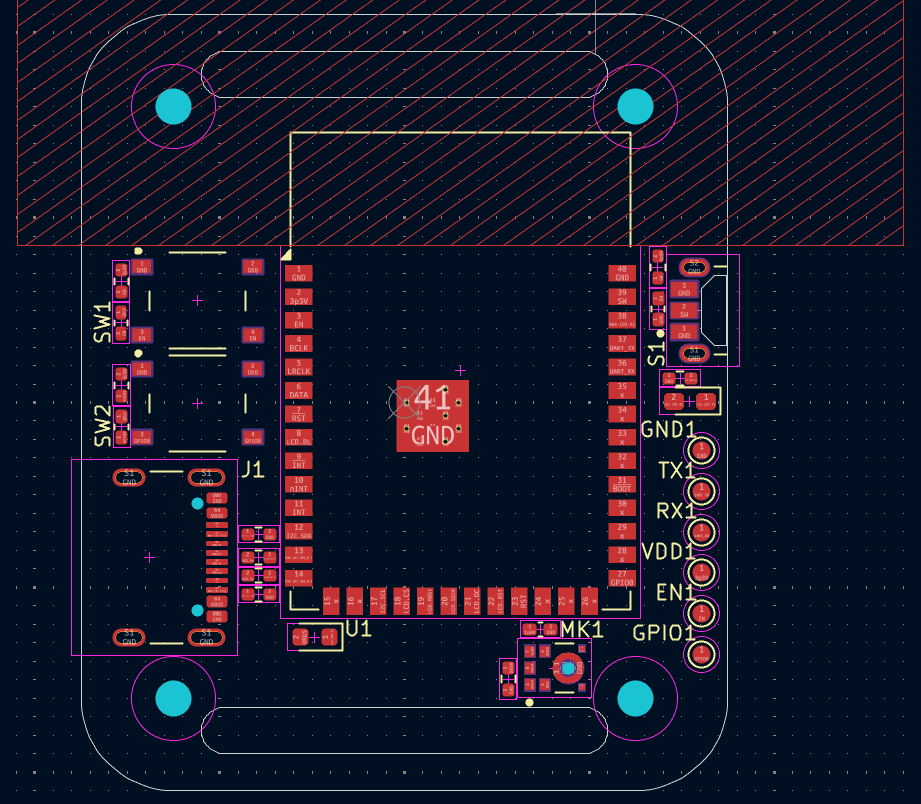
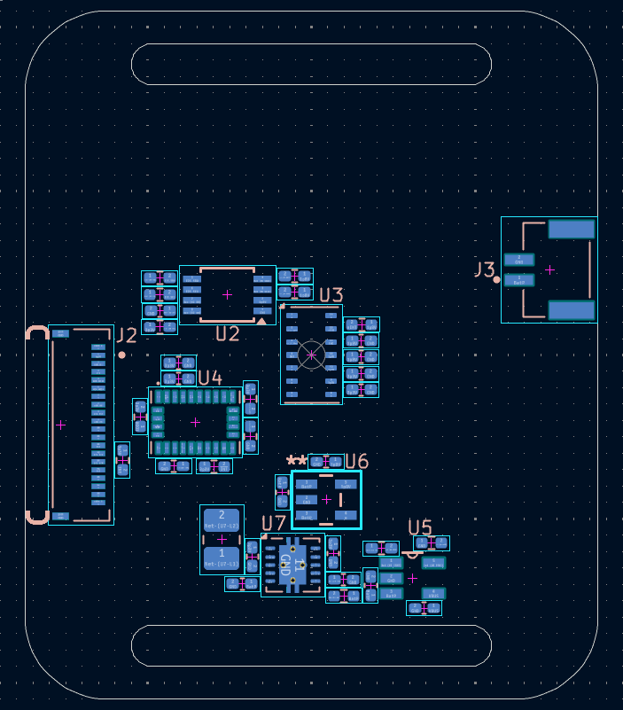
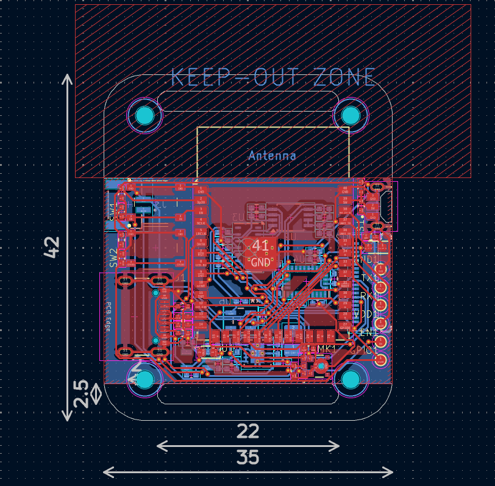
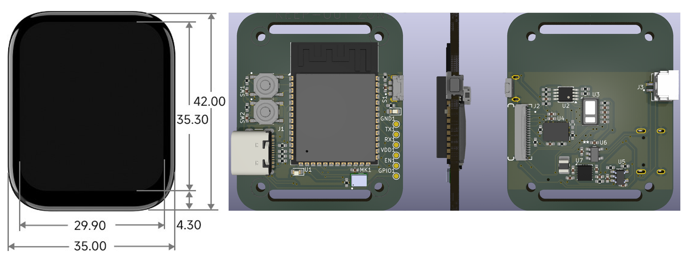

# Compact ESP32-S3 Smartwatch PCB with Multi-Sensor Integration

This repository contains all essential design files related to a compact smartwatch PCB based on the ESP32-S3 wireless microcontroller for wearable embedded applications. The smartwatch platform integrates physiological sensing, motion sensing, digital audio acquisition, wireless communication, display interfacing, and rechargeable power-management subsystems within a compact two-layer wearable PCB architecture.

The implemented smartwatch hardware integrates the following major subsystems:

* ESP32-S3-WROOM-1-N8R8 wireless MCU
* MAX30102 PPG heart-rate sensing subsystem
* BNO086 9-axis IMU sensing subsystem
* MMICT5848 digital MEMS microphone subsystem
* 1.83-inch IPS capacitive touch LCD interface
* USB Type-C charging and programming interface
* TPS63001 buck-boost power regulation subsystem
* LD56020 low-noise 1.8V regulation subsystem

You will find the following:

* Board Schematic: Complete smartwatch hardware schematic design
* PCB Layout: Two-layer wearable PCB implementation
* PCB Routing: Signal and power-routing implementation
* 3D PCB Views: Front-side, rear-side, and assembled PCB visualizations
* Manufacturing Files: Gerbers and fabrication outputs
* IEEE Project Report: Complete project documentation

## Tools Used

The electronic design and PCB development were completed using KiCad, an open-source EDA software platform.

* KiCad Version: 9.0.7

## PCB Design Details

* PCB Dimensions: 35 mm × 42 mm
* PCB Layers: 2
* Watch Strap Mounting Slots: 22 mm × 2.5 mm slots for standard smartwatch strap compatibility
* Passive Components: 0402_1005Metric_Pad0.72x0.64mm_HandSolder SMD package
* LEDs: 0603_1608Metric_Pad1.05x0.95mm_HandSolder SMD package
* Buck-Boost Power Inductor: 1008_2520Metric_Pad1.43x2.20mm_HandSolder SMD package

The PCB geometry and mounting-hole arrangement were designed to match commercially available 1.83-inch smartwatch display modules, enabling direct mechanical alignment and compatible display mounting within the wearable smartwatch assembly.

## Custom Libraries

Custom libraries were created to import specific schematic symbols, footprints, and 3D models required for the smartwatch hardware implementation.

Library names:

* MT2025513.kicad_sym : Imported schematic symbols
* MT2025513.pretty : Imported PCB footprints

All project-related files are attached within the repository.

## PCB Images

### System-Level Schematic

---

### Front and Rear PCB Layout

| Front-Side PCB                 | Rear-Side PCB                |
| ------------------------------ | ---------------------------- |
|  |  |

---

### Annotated Placement Strategy

---

### Front and Rear Component Placement

| Front-Side Placement                           | Rear-Side Placement                          |
| ---------------------------------------------- | -------------------------------------------- |
|  |  |

---

### PCB Dimensions, Routing, and Ground Pouring

  

---

### Final Smartwatch PCB Implementation

## Board Dimensions

| Parameter | Value |
| --------- | ----- |
| Width     | 35 mm |
| Height    | 42 mm |

---

## Design Files

### System-Level Hierarchical Schematic

[View Complete Schematic PDF](myOutputs/SmartWatch_MT2025513.pdf)

---

### BOM (Bill of Materials)

[View BOM CSV](myJobset/Fab-n-Assembly/bom.csv)

---

## Project Report

[View Project Report](Docs/Report_SmartWatch_MT2025513.pdf)

---

# License

This project is licensed under the MIT License. See the [LICENSE](LICENSE) file for details.

---

# Contact

Manish Pokhriyal
M.Tech ECE (VLSI), IIIT Bangalore

Email:
[Manish.Pokhriyal@iiitb.ac.in](mailto:Manish.Pokhriyal@iiitb.ac.in)

GitHub Profile:
https://github.com/manishpokhriyal-siliconarch

Project Repository:
https://github.com/manishpokhriyal-siliconarch/esp32s3-multisensor-smartwatch

---

# Acknowledgments

I would like to express my sincere gratitude to the International Institute of Information Technology Bangalore (IIIT-B) for providing the resources and academic support required for this project.

I am especially grateful to Dr. Kurian Polachan for his valuable guidance, technical insights, and continuous support throughout the development of this smartwatch hardware platform.
